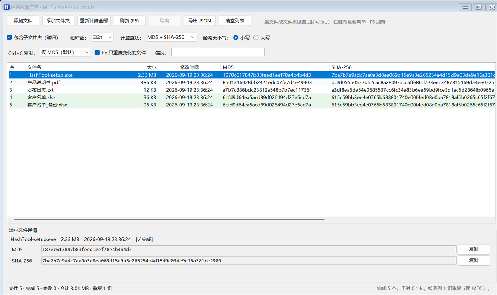

# HashTool · 哈希校验工具

**作者：wangxiaobao** · 一个只有 **130 KB** 的绿色单文件 Windows 桌面工具，拖进去就算 MD5 和 SHA-256。

[](#)
[](#)
[](#)
[](#)
[](LICENSE)
[](https://github.com/2935601977/HashTool/actions/workflows/build.yml)


拖入文件 / 文件夹 → 自动算出 **MD5 + SHA-256** → 导出 JSON 或右键复制。
不装 Python、不装 .NET SDK、不装任何运行库，就用 Windows 自带的编译器编译、
用系统自带的哈希 API（和 `Get-FileHash`、`certutil -hashfile` 是同一套）。



## 为什么这么小

| 你用的东西 | 它是什么 |
| --- | --- |
| 编译 | `C:\Windows\Microsoft.NET\Framework64\v4.0.30319\csc.exe`（Windows 自带） |
| 界面 | `System.Windows.Forms`（.NET Framework 4.x，系统内置） |
| 哈希 | `System.Security.Cryptography`——**和系统 `Get-FileHash` 同一套 API** |
| 拖拽 | WinForms 原生 `AllowDrop`，不需要任何第三方组件 |

所以：**一个文件、约 130 KB、双击就开、不写注册表、不留垃圾、不需要管理员权限**。
不用 Electron 那一套（动辄上百 MB），也不用 PyInstaller（启动要自解压到临时目录，
在没有写权限的环境里还会直接失败）。

## 下载

到 [Releases](../../releases) 下载 `HashTool.exe`，双击运行。
（Release 里还附了 `HashTool.exe.sha256`，可以用它自己校验自己 🙂

## 功能

- **拖入文件 / 文件夹**：窗口任意位置都能接收拖拽，一次拖多个也行
- **拖到 exe 图标上也能用**：把文件/文件夹直接拖到 `HashTool.exe` 上，程序会启动并自动开始计算
  （Windows 是把路径当启动参数传进来的，所以命令行 `HashTool.exe D:\某个文件夹` 效果一样）
- **文件夹递归**：默认开启，可关闭；自动跳过符号链接 / 联接点，不会成环
- **MD5 + SHA-256 一遍算**：1 MiB 分块读取，多线程并发（线程数可选：自动 / 1 / 2 / 4 / 8 / 16）
- **只算一个算法也行**：`仅 MD5（更快）` / `仅 SHA-256`，切换时自动补算缺的那个
- **F5 增量刷新**：只重算变过的文件，没变的沿用上次结果（[原理见下](#f5-增量刷新是怎么判断变化的)）
- **导出 JSON**：一次导出整张表，含大小、时间、状态、重复标记等
- **复制方式随便挑**：右键菜单 + 一个「Ctrl+C 复制」下拉（默认只复制 MD5，也可以 MD5+SHA-256 一行一个文件）
- **大小写自由切换**：大写 / 小写，切换立刻刷新显示和导出，**不会重新计算**（哈希只算一遍）
- **重复文件识别**：同哈希的文件自动绿色高亮并在状态栏计数
- 其它：表头排序、关键词筛选、进度条、随时取消、双击复制 SHA-256、`Delete` 移除、`Ctrl+A` 全选

### 快捷键

| 按键 | 作用 |
| --- | --- |
| `F5` | 刷新（重新扫描 + 只重算变化的文件） |
| `Ctrl+O` / `Ctrl+Shift+O` | 添加文件 / 添加文件夹 |
| `Ctrl+S` | 导出 JSON |
| `Ctrl+C` | 按「Ctrl+C 复制」下拉的设置复制选中行 |
| `Ctrl+A` | 全选 |
| `Delete` | 移除选中行 |
| 双击某行 | 复制该文件的 SHA-256 |
| 拖到 exe 图标 | 用启动参数打开该文件/文件夹并自动计算 |

## F5 增量刷新是怎么判断"变化"的

指纹 = **文件大小 + 最后修改时间**（一次 `stat` 就能拿到，不用读内容——rsync 和各种同步备份工具都是这个做法）。

按 `F5` 时：

1. 重新扫描你添加过的根目录：**新增的**文件加进来并计算，**消失的**文件从列表移除；
2. 已存在的文件比对指纹：**大小或修改时间变了**（或上次是失败/取消、缺少当前算法的哈希）→ 重算，**没变** → 直接沿用上次结果；
3. 状态栏写清楚：`刷新完成：新增 0 个，变化 1 个，移除 0 个，未变化 2 个（沿用上次结果），本次重算 1 个`。

**什么时候不适用**：如果有程序改了内容却把大小和修改时间都改回原样（极少数工具会），指纹看不出来。
这种情况、或者你就是想重新确认一遍，点 **「重新计算全部」**——它永远全量重算。
不想要增量行为，把「F5 只重算变化的文件」勾掉即可。

## 导出的 JSON

<details>
<summary>点开看完整结构</summary>

```json
{
  "tool": "HashTool",
  "version": "1.1.0",
  "author": "wangxiaobao",
  "generated_at": "2026-09-18T20:33:28+08:00",
  "hash_case": "lower",
  "algorithms": ["md5", "sha256"],
  "summary": {
    "file_count": 2, "ok": 2, "failed": 0, "canceled": 0, "pending": 0,
    "total_bytes": 28, "total_size_human": "28 B",
    "duplicate_groups": 1, "duplicate_files": 2
  },
  "files": [
    {
      "name": "a.txt",
      "path": "D:\\data\\a.txt",
      "root": "D:\\data",
      "size": 14,
      "size_human": "14 B",
      "modified": "2026-09-18T20:04:12+08:00",
      "md5": "9c10f8f8279362e036767fd21fe1f19e",
      "sha256": "599e0d59e6d520c42d8356320ecf4fcac1b8c7152c574f159494bef9fc49b8c1",
      "state": "ok",
      "state_text": "✓ 完成",
      "error": null,
      "elapsed_ms": 14.54,
      "duplicate_of_md5": true
    }
  ]
}
```

- `hash_case`：导出时是大写还是小写。
- `algorithms`：这次算了哪些算法；没算的那个字段是空字符串。
- 文件是 UTF-8 编码、无 BOM。

</details>

## 从源码编译

不需要装任何东西——Windows 10/11 自带 .NET Framework 4.x，也就自带 C# 编译器。

```bat
:: 双击 build.bat 即可，或者命令行：
build.bat
```

产物是 `dist\HashTool.exe`。源码只有 `src\HashTool.cs` 一个文件，改完重跑 `build.bat` 就行。

<details>
<summary>为什么没有 .sln / .csproj？</summary>

因为本项目的卖点就是"不依赖任何 SDK"。加一个工程文件就要求使用者装 MSBuild / Visual Studio，
反而把门槛抬高了。`build.bat` 里那一行 `csc.exe` 命令就是全部构建逻辑，看一眼就明白。

如果你习惯用 Visual Studio 调试，用 VS 打开 `src\HashTool.cs`（"打开文件"即可）也能直接在
编辑器里看代码、改代码，只是交给 `build.bat` 编译。
</details>

## 自检

改完代码想确认没改坏，exe 自带三个自检入口（正常使用用不到）：

```bat
dist\HashTool.exe --selftest                  :: 已知哈希向量 + 界面构造 + 递归扫描
dist\HashTool.exe --uitest .\ui_out           :: 界面全自动跑一遍，13 项断言，跑完自动清理
dist\HashTool.exe --screenshot docs\shot.png  :: 生成界面截图（README 那张图就是这么来的）
dist\HashTool.exe --version                   :: 版本号
```

`--uitest` 会自己造测试目录并验证：递归扫描、首次计算、**F5 无改动不重算**、
**改一个文件只重算那一个**、**新增文件被拾取**、**Ctrl+C 三种复制格式**、
**详情区布局不折行**、两份 JSON 导出——然后删掉临时目录。

CI（[`.github/workflows/build.yml`](.github/workflows/build.yml)）每次提交都会跑上面这些，
并且额外用**系统自带的 `Get-FileHash`** 逐文件对照，确认算出来的哈希和微软的实现完全一致。

## 常见问题

<details>
<summary><b>会算错吗？</b></summary>

哈希算法是 .NET Framework 自带的实现（和系统 `Get-FileHash` 用的是同一个底层），
工具本身只负责"分块读文件 → 喂给算法"。CI 里每次都拿 `Get-FileHash` 交叉验证，
`--selftest` 还固定测了 `"abc"` 和空文件的公开测试向量。
</details>

<details>
<summary><b>会不会被杀软 / SmartScreen 报毒？</b></summary>

没有加壳、没有自解压、没有联网、没有注册表操作，就是一个普通的 .NET 程序。
不过任何没有代码签名的 exe，首次运行都可能被 SmartScreen 提示"未知发布者"——
点"更多信息 → 仍要运行"即可，或者直接用 `build.bat` 自己编译一个。
</details>

<details>
<summary><b>大文件、超大目录吃得消吗？</b></summary>

文件是流式分块读的（1 MiB 一块），内存占用与文件大小无关，几百 GB 的文件也没问题；
进度条按已读字节数走，随时可以取消。目录里的文件数只受内存限制，
界面用了虚拟列表（ListView 虚拟模式），几万个文件也不会卡。
</details>

<details>
<summary><b>文件正被其它程序占用怎么办？</b></summary>

本工具用 `FileShare.ReadWrite | Delete` 打开文件，能读的都会尽量读出来；
实在被独占锁定的，那一行会标成「✗ 失败」并在详情里写明原因，不影响其它文件继续算。
</details>

<details>
<summary><b>能拿它校验别人给的哈希值吗？</b></summary>

目前只负责算和导出，不做"比对"这一步（把结果复制出去用记事本/Excel 对一下就行）。
如果想要内置的比对功能，欢迎提 Issue 或 PR。
</details>

<details>
<summary><b>支持 Linux / macOS 吗？</b></summary>

不支持，也不打算支持——本项目的定位就是"把 Windows 自带的东西用足"。
在 Linux 上直接用 `md5sum` / `sha256sum` 更合适。
</details>

## 已知限制

- 被其它程序独占锁定且不允许共享读取的文件会记为「✗ 失败」并写明原因，不影响其它文件。
- 超过 260 字符的超长路径取决于系统是否开启长路径支持。
- F5 增量刷新依赖「大小 + 修改时间」指纹，要绝对保险就用「重新计算全部」。
- 「移除选中」掉的路径在本次会话内不会被 F5 重新扫回来；点「清空列表」可复原。

## 项目结构

```
src/HashTool.cs        全部源码（界面 + 扫描 + 哈希 + JSON + 自检），单文件
src/app.ico            程序图标
src/app.manifest       高 DPI 感知 + 普通权限运行
tools/make-icon.ps1    重新生成图标与 docs/icon.png
build.bat              编译（系统自带 csc.exe，产物 dist/HashTool.exe）
docs/                  README 用的图片
.github/               CI（编译 + 自检 + 交叉校验 + 发布）
```

想参与开发请先看 [CONTRIBUTING.md](CONTRIBUTING.md)（两条硬约束：不引第三方依赖、保持 C# 5 语法）。

## 版本历史

见 [CHANGELOG.md](CHANGELOG.md)。当前版本 **v1.1.0**。

## 许可证

[MIT](LICENSE) © 2026 wangxiaobao

---

<sub>用 Windows 自带的东西做的哈希工具：单文件、无依赖、不装运行时。</sub>
